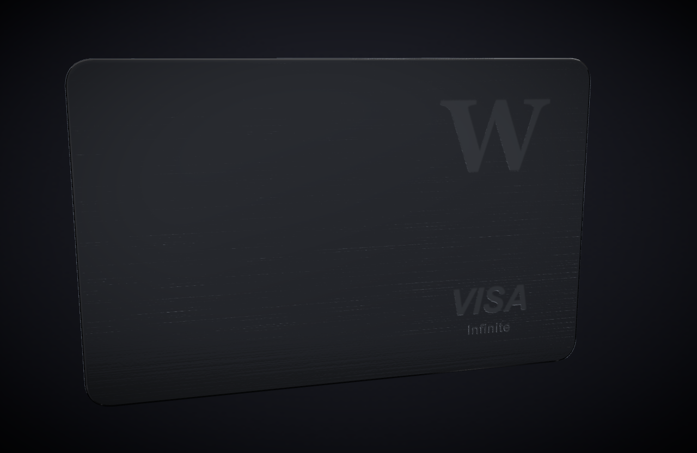

# Metal Card — brushed-metal credit card, WebGL prototype

A premium, gyroscope-responsive **brushed-metal credit card** rendered with WebGL
(React Three Fiber + three.js). Highlights and reflections sweep across the
surface as you tilt your phone (or move the mouse on desktop). The card is
**flippable** — a stealth-black front with matte, opaque, non-metallic **W** +
**VISA** logos and a metallic **EMV chip**, and a two-tone back with a
**holographic silver dove** (a procedural chrome + rainbow fragment shader that
sweeps through the spectrum as the card tilts).

Built **web-first** for fast shader iteration, with a renderer-agnostic core
(`src/card` + `src/tilt`) structured to **port to Expo/React Native** later.



## Quick start

```bash
npm install --legacy-peer-deps   # see "Dependencies" note below
npm run dev
```

Open the printed `http://localhost:5173/`.

- **Desktop:** move the cursor to sweep the light; **click the card** to flip;
  tune everything live in the **DialKit** panel (top-right).
- DialKit folders: **Material** (roughness, anisotropy, clearcoat, env intensity,
  normal scale, logo sheen, matcap A/B), **Textures** (brush/sand strength, brush
  density, emboss depth, logo roughness — regenerates the maps), **Bird
  (hologram)** (holo strength, chrome brightness, hue scale, shimmer speed),
  **Lighting** (key / fill / streak / back softbox intensities), **Motion** (tilt
  strength, sweep, parallax, follow + flip damping, idle drift), **View** (zoom),
  **Post** (bloom, vignette), **Card** (flip).

## Testing the real gyroscope on a phone

iOS only delivers motion events in a **secure (HTTPS) context** — a plain
`http://<LAN-IP>` will silently do nothing. Two ways to get HTTPS:

**A. Tunnel (least friction, trusted cert):**
```bash
npm run dev
npx cloudflared tunnel --url http://localhost:5173   # or: ngrok http 5173
```
Open the tunnel URL on the phone.

**B. Self-signed on LAN:**
```bash
HTTPS=true npm run dev -- --host
```
Open `https://<your-LAN-IP>:5173` on the phone and trust the certificate
(iOS: Settings → General → VPN & Device Management, then enable full trust in
Certificate Trust Settings).

Then tap **“Enable motion”** (iOS 13+ permission prompt) and tilt the phone —
reflections and the anisotropic streaks glide across the metal, with a subtle
card parallax. Tap the card to flip.

## URL params (handy for demos/captures)

- `?flip` — start showing the back
- `?matcap` — start in the env-free matcap look
- `?bare` — hide the leva panel and hint (clean capture)

e.g. `http://localhost:5173/?bare&flip`

## How it works

- **Material (hero look):** `MeshPhysicalMaterial`, `metalness = 1`, near-black
  color, with **anisotropy** for the brushed highlight, **clearcoat**, and
  procedurally-generated **normal + roughness maps** (sandblast grain + engraved
  logos). Lit by an image-based **studio softbox** built from drei
  `<Lightformer>`s (no external HDRI to load).
- **Gyro response:** tilt drives `scene.environmentRotation`, so the reflected
  softboxes + anisotropic streak sweep — cheaper and steadier than moving lights.
- **Matcap A/B:** a `MeshMatcapMaterial` using a procedurally-baked brushed
  matcap — instant premium metal with no environment, and the safe path for the
  Expo port. Toggle in the Material panel.
- **Color-space correctness:** ACESFilmic tone mapping; base color in sRGB;
  normal/roughness data maps in `NoColorSpace` (linear).

## Project structure

```
src/
  App.jsx                 app shell: Canvas, studio env, tilt wiring, postFX, leva
  card/
    MetalCard.jsx         geometry + per-face materials + flip/tilt   (portable core)
    cardConfig.js         dialed-in values (dimensions, material, tilt, post)
    geometry.js           rounded card body + normalized-UV faces
    proceduralMaps.js     brushed grain + engraved logos + brushed matcap
  tilt/
    useDeviceTilt.js      gyro (+ iOS permission) + pointer fallback   (portable core)
  ui/
    PermissionButton.jsx  iOS "Enable motion" gate
scripts/
  shot.mjs                dev-only puppeteer screenshot helper
```

## Tuning to match the references

All the dialed-in numbers live in **`src/card/cardConfig.js`** (card dimensions,
material, tilt, post). Iterate live with the DialKit panel, then copy the values
you like back into `cardConfig.js` to make them the defaults.

## Expo / React Native port (follow-on)

The `card/` + `tilt/` modules are renderer-agnostic on purpose. To port:

- Canvas → `@react-three/fiber/native` + `expo-gl`; drei imports → `@react-three/drei/native`
- Sensors → `expo-sensors` `DeviceMotion` (no gesture/permission dance)
- **Drop postprocessing** (doesn't run on expo-gl) — lean on the in-material look
- **Replace the DialKit panel** (web-only) with the frozen `cardConfig.js` values
- **Fallback:** the **matcap** material needs no env/PMREM and ports trivially —
  use it as the native safety net
- Pin/verify the `expo-gl` version against the R3F-native peer before device testing

## Dependencies note

Install with `--legacy-peer-deps`. `@react-three/drei@10` declares a peer of
`@react-three/fiber@^9`, which is satisfied, but npm's resolver false-positives
on the pmndrs peer graph. Versions are pinned (three 0.185, R3F 9, React 19).
Controls use **DialKit** (`dialkit` + `motion`); the extracted dove mask lives at
`public/logos/bird.png`.

## Screenshots (dev)

`node scripts/shot.mjs [url] [outPath] [waitMs]` drives the system Chrome
(software WebGL) to grab a still and report page errors — useful for CI-less
visual checks. It is **not** part of the app bundle.
